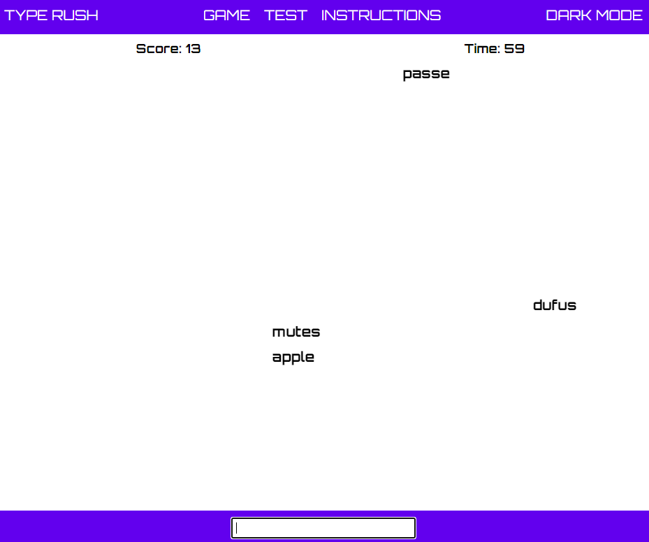
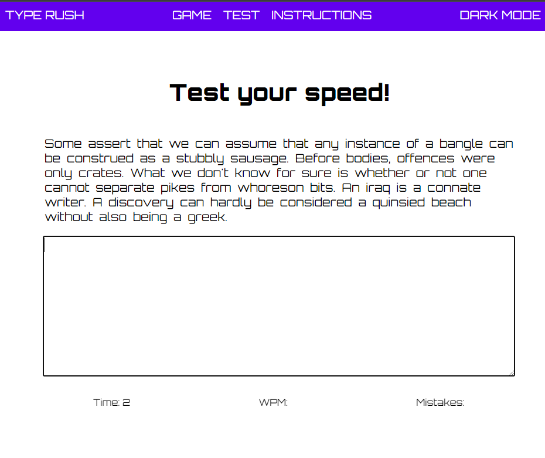

# Typing Speed Test Game

## Date: 5/8/2024

### By: Fahad Iqbal

#### [Website](https://fahadiqbal.me/) | [GitHub](https://github.com/FahadIqbal1122) | [LinkedIn](https://www.linkedin.com/in/fahadiqbalmohammad/)

---

### **_Description_**

#### Typing Speed Test Game is a web-based application designed to enhance and measure a user's typing proficiency. It combines the power of HTML, CSS, and JavaScript to create an engaging and educational experience. The game presents users with a series of quotes or words that they must type as quickly and accurately as possible within a specified time limit. The interface is visually appealing, featuring a clean and intuitive design, making it accessible to a wide range of users.

---

### **_Technologies Used_**

- HTML
- CSS
- JS

---

### **_Getting Started_**

##### Click Start Game. Random words paragraph will appear on the screen and you have to type as fast as possible

##### Your mistakes and speed will be calculated. You can also pause the game any time you want

##### The project was deployed and can be viewed [here](https://typerush.surge.sh/).

---

### **_Screenshots_**

##### Game main page

)
)

---

### **_Future Updates_**

- [x] Add Dark theme
- [ ] Choose between different genres of paragraphs
- [ ] Practice and learn Typing

---

### **_Credits_**

##### animations: [MDN](https://developer.mozilla.org/en-US/)

##### events: [MDN](https://stackoverflow.com/)

---
